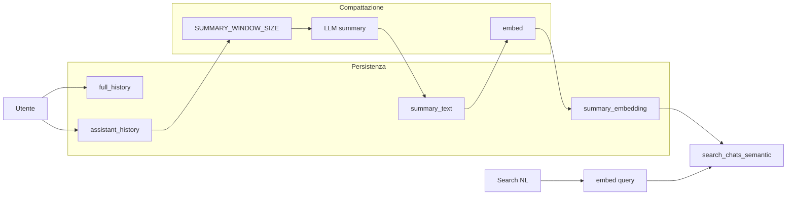

# Piano: Chat Memory & Conversation Compaction

## 1. Documentazione e regola di progetto

- **Sostituire** [Description.md](Description.md) con il nuovo documento fornito ("Chat Memory & Conversation Compaction"). Il file attuale descrive la voice chat Gemini; il nuovo diventa la specifica per memoria chat e compattazione.
- **Regola di progetto (vincolante)**: creare un file in `.cursor/rules/` (es. `embedding-text.mdc`) con la regola: *"Qualsiasi cosa abbia un embedding DEVE avere anche una rappresentazione testuale in chiaro"* (motivi: debug, ispezione, qualità, spiegabilità). In assenza di `.cursor/rules` nel repo, la regola va creata lì per avere effetto in Cursor.

---

## 2. Database: tabella `chats` (già creata su Supabase)

La tabella `chats` è già presente su Supabase. Riferimento struttura attesa:

| Colonna             | Tipo        | Note                                                      |
| ------------------- | ----------- | --------------------------------------------------------- |
| `id`                | uuid        | PK                                                        |
| `user_id`           | uuid        | Proprietario                                              |
| `title`             | text        | Generato da LLM da summary_text                           |
| `full_history`      | jsonb       | Array di turni completi (utente)                          |
| `assistant_history` | jsonb       | Array di turni per il modello (compattato)                |
| `summary_text`      | text        | Rappresentazione in chiaro (gemella di summary_embedding) |
| `summary_embedding` | vector      | pgvector (per similarity search)                          |
| `last_activity_at`  | timestamptz | Ultima interazione                                        |
| `created_at`        | timestamptz | Creazione                                                 |

- **Forma dei turni in full_history / assistant_history**: stesso formato già usato per la conversazione (localStorage): `ConversationTurn` → `{ role: 'user' | 'model', parts: [{ text: string }], thinking?: string }`. Il messaggio di summary è un turno vero: es. `{ role: 'model', parts: [{ text: "
" }] }`.
- **RPC già creata su Supabase**: `search_chats_semantic` — permette all'assistente di capire in quale chat spostarsi (ricerca semantica su `summary_embedding`). Usarla nelle API per lo switch in linguaggio naturale.
- **Tipi TypeScript**: aggiornare [app/lib/supabase/database.types.ts](app/lib/supabase/database.types.ts) con `chats` (Row/Insert/Update) e con la signature della RPC `search_chats_semantic`, allineati alla tabella e alla funzione già presenti su Supabase.

Riferimento pattern: [app/api/memory/episodic/functions.ts](app/api/memory/episodic/functions.ts) (embed come stringa JSON) e [app/api/memory/semantic/route.ts](app/api/memory/semantic/route.ts).

---

## 3. Costanti e forma del messaggio summary

- **Parametri compattazione** (es. in `app/lib/voice-chat/config/` o in env):
  - `SUMMARY_WINDOW_SIZE` = 30
  - `TAIL_SIZE` = 10–15 (messaggi recenti da non compattare)
- **Comportamento**: finché `assistant_history.length <= SUMMARY_WINDOW_SIZE` nessuna compattazione. Quando supera: prendere i **primi** `SUMMARY_WINDOW_SIZE` turni → generare un unico summary (testo) → creare **un** turno summary (stessa forma `ConversationTurn`) → sostituire quei turni con quel singolo turno in `assistant_history`; aggiornare `summary_text` e `summary_embedding` a livello chat (rappresentazione semantica della chat per lo switch).
- **summary_text / summary_embedding a livello chat**: aggiornati a ogni compattazione; rappresentano il contenuto della chat per similarity search. Scelta implementativa: dopo ogni compattazione, generare testo (e relativo embedding) che riassume il contesto attuale della chat (es. da `assistant_history` aggiornata) e usarlo per popolare `summary_text` e `summary_embedding`.

---

## 4. API `/api/chats`

Struttura coerente con [app/api/memory/episodic/](app/api/memory/episodic/) (auth da cookie Supabase, `ensureAuth`):

- **POST /api/chats** – Crea chat (body opzionale: `title`, messaggi iniziali). Inizialmente `full_history` e `assistant_history` uguali; `summary_text`/`summary_embedding` vuoti finché non c’è compattazione.
- **GET /api/chats** – Lista chat dell’utente (query params: `id` per singola chat; opzionale `search` per switch in linguaggio naturale).
  - Con `id`: ritorna la chat (per UI usare `full_history`, per contesto modello usare `assistant_history`).
  - Con `search`: embed della query → RPC `search_chats_semantic` (già presente su Supabase) → ranking (similarità + `last_activity_at`) → risposta con 1 o più match (conferma se multipli).
- **PATCH /api/chats** – Append messaggi: append a `full_history` e `assistant_history`; aggiornare `last_activity_at`; se `assistant_history.length > SUMMARY_WINDOW_SIZE` eseguire compattazione (sliding summary), poi aggiornare `summary_text` e `summary_embedding` a livello chat.
- **DELETE /api/chats** (opzionale) – Elimina chat.

Logica di compattazione e generazione summary/embedding in un modulo condiviso (es. `app/api/chats/functions.ts`), riutilizzando [app/lib/embeddings](app/lib/embeddings) e un servizio LLM per il testo del summary (es. Gemini come per le memorie).

---

## 5. Generazione summary e titolo

- **Summary (compattazione)**: servizio che, dati N `ConversationTurn`, chiama l’LLM per produrre un unico testo di riassunto; poi `embed(summaryText)` per `summary_embedding`. Riutilizzare dove possibile la logica di [app/lib/voice-chat/storage/summarizer.ts](app/lib/voice-chat/storage/summarizer.ts) (attualmente stub): implementare la chiamata reale a Gemini e restituire il testo.
- **Titolo chat**: generato dall’LLM a partire da `summary_text` (o da `assistant_history` se summary_text ancora vuoto). Aggiornato la prima volta quando il topic è chiaro; in seguito solo se il focus cambia (criterio da definire, es. dopo compattazione con delta significativo).

---

## 6. Integrazione client (voice chat)

- **useVoiceChat** e **VoiceChatClient**: aggiungere supporto a un `chatId` (es. da route o contesto). All’avvio: se `chatId` presente, GET `/api/chats?id=chatId` e caricare `assistant_history` per `sendHistory()` e `full_history` per lo stato messaggi in UI; se assente, creare nuova chat (POST) e usare il suo `id`.
- **Salvataggio**: al posto di (o in aggiunta a) `ConversationStorage` su localStorage, chiamare PATCH `/api/chats` con i nuovi turni (append) in `goToIdle` / `goToWakeWord` e prima di switchare chat. Obiettivo: dopo questa implementazione **non** dipendere più dal localStorage per la persistenza della conversazione (il doc lo esplicita).
- **Tool / UX “switch chat”**: comando tipo “Passiamo alla chat in cui parlavamo di X” → chiamata GET `/api/chats?search=<query>` → se un match chiaro, switch a quel `chatId` e ricaricare contesto; se multipli, risposta con opzioni e conferma (tool che restituisce lista o chiede conferma).

---

## 7. Regole assistente e allineamento memorie

- **Assistente**: in system instruction o doc, specificare che deve usare **solo** `assistant_history` (mai `full_history`), trattare i summary come verità consolidata, non ricostruire messaggi eliminati, non usare keyword, usare `summary_text` + `summary_embedding` come fonte per lo switch.
- **Memorie episodic/semantic**: hanno già `content` (testo) + `embedding`; rispettano la regola “embedding + testo in chiaro”. Nessuna modifica obbligatoria; eventuale controllo che non ci siano keyword usate come meccanismo (il doc vieta keyword per le chat, non necessariamente per le memorie).

---

## Diagramma flusso (sintesi)

---

## Ordine suggerito

1. Regola di progetto + aggiornamento Description.md
2. Tipi TypeScript in [app/lib/supabase/database.types.ts](app/lib/supabase/database.types.ts) per `chats` e RPC `search_chats_semantic` (allineati alla tabella e alla RPC già create)
3. Costanti e forma ConversationTurn per summary
4. Modulo compattazione (summary + embed) e funzioni chat (CRUD, append, compattazione)
5. Route API `/api/chats` (POST, GET con id/search, PATCH)
6. Integrazione useVoiceChat/VoiceChatClient con chatId e PATCH; riduzione/rimozione persistenza localStorage
7. Tool/UX per switch tra chat in linguaggio naturale e generazione titolo
8. Verifica finale: solo assistant_history al modello, niente keyword, embedding sempre affiancato da summary_text

