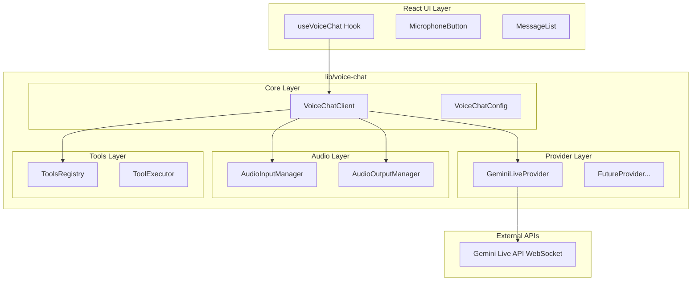
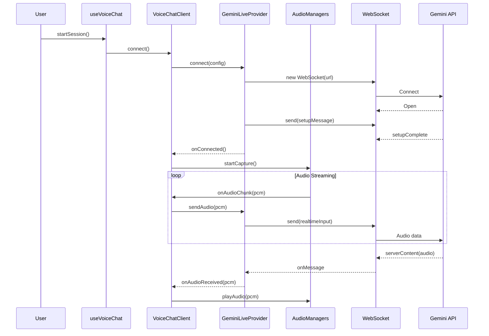

# Implementazione Gemini Live Voice Chat

## Architettura



## Struttura Directory

```
lib/
└── voice-chat/
    ├── index.ts                    # Barrel exports
    ├── types/
    │   ├── index.ts
    │   ├── client.types.ts         # Tipi client/sessione
    │   ├── messages.types.ts       # Tipi messaggi WebSocket
    │   ├── audio.types.ts          # Tipi audio
    │   └── tools.types.ts          # Tipi function calling
    ├── config/
    │   ├── index.ts
    │   ├── default.config.ts       # Configurazione default
    │   └── voices.config.ts        # Voci disponibili
    ├── providers/
    │   ├── index.ts
    │   ├── base.provider.ts        # Interface astratta
    │   └── gemini/
    │       ├── index.ts
    │       ├── gemini-live.provider.ts
    │       ├── gemini-connection.ts
    │       └── gemini-messages.ts
    ├── audio/
    │   ├── index.ts
    │   ├── audio-input.manager.ts  # Cattura microfono
    │   ├── audio-output.manager.ts # Riproduzione audio
    │   └── audio-utils.ts          # Utilities PCM/Base64
    ├── tools/
    │   ├── index.ts
    │   ├── tools-registry.ts       # Registro tools (vuoto)
    │   └── tool-executor.ts        # Esecutore tools
    └── client/
        ├── index.ts
        └── voice-chat.client.ts    # Client principale
```

## Moduli Principali

### 1. VoiceChatClient (`lib/voice-chat/client/voice-chat.client.ts`)

Client principale che orchestra tutti i moduli:

```typescript
interface VoiceChatClientOptions {
  provider: VoiceChatProvider;
  config: VoiceChatConfig;
  tools?: ToolDefinition[];
  onTranscript?: (text: string, type: 'input' | 'output') => void;
  onStateChange?: (state: ConnectionState) => void;
  onError?: (error: VoiceChatError) => void;
}

class VoiceChatClient {
  connect(): Promise<void>;
  disconnect(): void;
  startListening(): Promise<void>;
  stopListening(): void;
  sendText(text: string): Promise<void>;
  setMuted(muted: boolean): void;
}
```

### 2. Base Provider Interface (`lib/voice-chat/providers/base.provider.ts`)

Interfaccia astratta per permettere futuri provider:

```typescript
interface VoiceChatProvider {
  readonly name: string;
  connect(config: ProviderConfig): Promise<void>;
  disconnect(): void;
  sendAudio(data: ArrayBuffer): Promise<void>;
  sendText(text: string): Promise<void>;
  sendActivityStart(): Promise<void>;
  sendActivityEnd(): Promise<void>;
  sendToolResponse(response: ToolResponse): Promise<void>;
  on(event: ProviderEvent, handler: EventHandler): void;
}
```

### 3. GeminiLiveProvider (`lib/voice-chat/providers/gemini/gemini-live.provider.ts`)

Implementazione specifica per Gemini Live API:

- Gestione WebSocket a `wss://generativelanguage.googleapis.com/ws/...`
- Setup message con configurazione sessione
- Parsing messaggi server (serverContent, toolCall, setupComplete)
- Encoding/decoding audio PCM 16-bit

### 4. AudioInputManager (`lib/voice-chat/audio/audio-input.manager.ts`)

Gestione cattura audio dal microfono:

- Web Audio API + MediaRecorder
- PCM 16-bit, 16kHz, mono
- Chunking per streaming continuo
- VAD opzionale client-side

### 5. AudioOutputManager (`lib/voice-chat/audio/audio-output.manager.ts`)

Gestione riproduzione audio:

- Audio queue per buffering
- Riproduzione streaming incrementale
- Gestione interruzioni (svuota queue)
- Sample rate 24kHz output

### 6. ToolsRegistry (`lib/voice-chat/tools/tools-registry.ts`)

Registro tools predisposto ma vuoto:

```typescript
class ToolsRegistry {
  private tools: Map<string, ToolDefinition> = new Map();
  
  register(tool: ToolDefinition): void;
  unregister(name: string): void;
  getDeclarations(): FunctionDeclaration[];
  execute(call: FunctionCall): Promise<FunctionResponse>;
}
```

## Tipi Principali

### `lib/voice-chat/types/messages.types.ts`

```typescript
// Client -> Server
interface SetupMessage { setup: SessionConfig; }
interface RealtimeInputMessage { 
  realtimeInput: { 
    audio?: { data: string; mimeType: string; };
    activityStart?: {};
    activityEnd?: {};
  }; 
}
interface ToolResponseMessage { toolResponse: { functionResponses: FunctionResponse[]; }; }

// Server -> Client
interface ServerMessage {
  setupComplete?: {};
  serverContent?: {
    modelTurn?: { parts: Part[]; };
    turnComplete?: boolean;
    interrupted?: boolean;
    inputTranscription?: { text: string; };
    outputTranscription?: { text: string; };
  };
  toolCall?: { functionCalls: FunctionCall[]; };
  usageMetadata?: UsageMetadata;
}
```

## Flusso Dati



## Integrazione con Hook Esistente

Modifiche minime a [app/hooks/useVoiceChat.ts](app/hooks/useVoiceChat.ts):

```typescript
import { VoiceChatClient, createGeminiProvider } from '@/lib/voice-chat';

const useVoiceChat = () => {
  const clientRef = useRef<VoiceChatClient | null>(null);
  
  const startSession = useCallback(async () => {
    const provider = createGeminiProvider({ apiKey: process.env.GEMINI_API_KEY });
    const client = new VoiceChatClient({
      provider,
      config: { voice: 'Kore', language: 'it-IT' },
      tools: [], // Lista vuota, da popolare in futuro
      onTranscript: (text, type) => {
        // Aggiorna messaggi
      }
    });
    await client.connect();
    await client.startListening();
    clientRef.current = client;
  }, []);
  
  // ...
};
```

## Configurazione

### `lib/voice-chat/config/default.config.ts`

```typescript
export const defaultConfig: VoiceChatConfig = {
  model: 'gemini-2.5-flash-native-audio-preview-12-2025',
  voice: 'Kore',
  language: 'it-IT',
  responseModalities: ['AUDIO'],
  audioInput: {
    sampleRate: 16000,
    channels: 1,
    bitDepth: 16,
  },
  audioOutput: {
    sampleRate: 24000,
    channels: 1,
    bitDepth: 16,
  },
  vad: {
    enabled: true, // Server-side VAD
    clientSide: false,
  },
  transcription: {
    input: true,
    output: true,
  }
};
```

## Dipendenze Necessarie

```bash
npm install @google/genai
```

Nessuna altra dipendenza esterna - utilizzo Web Audio API nativa del browser.

## Note Implementative

1. **API Key Security**: Per produzione, usare ephemeral tokens invece di API key diretta
2. **Error Handling**: Ogni modulo gestisce i propri errori e li propaga al client
3. **Cleanup**: Ogni manager implementa `dispose()` per rilasciare risorse
4. **Type Safety**: Tutti i tipi sono strict, no `any`
5. **Testabilità**: Provider pattern permette mock per testing